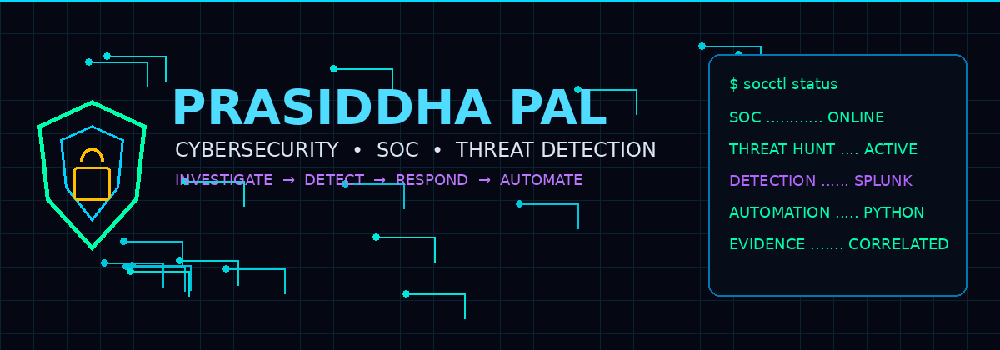
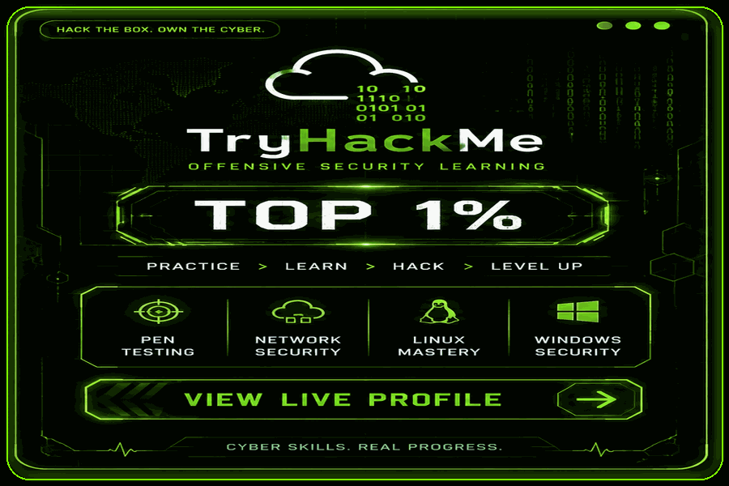
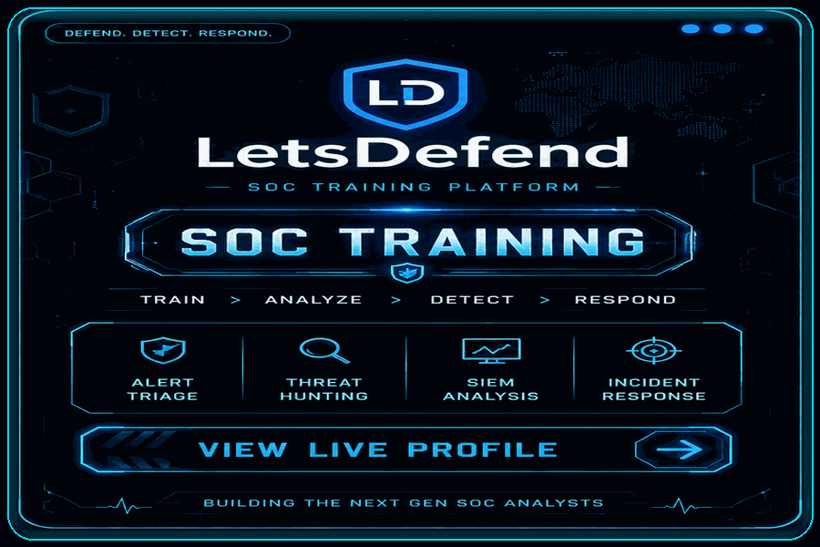

<div align="center">



# 🛡️ PRASIDDHA PAL

### `CYBERSECURITY` · `SOC` · `THREAT DETECTION`

**SOC Operations · Threat Hunting · Detection Engineering · Incident Response**

🟢 **OPEN TO WORK**

`SOC Analyst` · `Cybersecurity` · `Threat Detection` · `Security Operations`

<br>

<a href="https://github.com/prasiddhapal">

</a>
<a href="https://tryhackme.com/p/famous33">

</a>
<a href="https://app.letsdefend.io/user/PrasiddhaPal">

</a>
<a href="https://www.linkedin.com/in/prasiddha-pal">

</a>
<a href="https://medium.com/@prasiddhapal">

</a>

&nbsp;


<br><br>


<div align="center">

| 🟢 SOC INVESTIGATION | 🔵 THREAT HUNTING | 🟣 DETECTION ENGINEERING | 🟠 SECURITY AUTOMATION |
| :---: | :---: | :---: | :---: |
| **30+ CASES** | **ACTIVE** | **SPLUNK / SIEM** | **PYTHON / AI** |

</div>

---

## 👨‍💻 WHOAMI

<table>
<tr>
<td width="55%">

```text
┌─────────────────────────────────────────┐
│ PRASIDDHA PAL                           │
├─────────────────────────────────────────┤
│ ROLE    : Cybersecurity Practitioner    │
│          : SOC Analyst                  │
│ STATUS  : 🟢 Open to Work              │
│ FOCUS   : Detection • Investigation     │
│          : Threat Hunting               │
│ SYSTEMS : Linux • Windows • Networking  │
│ TOOLS   : Splunk • SIEM • Python        │
│          : Wireshark • Nmap             │
│ MINDSET : Evidence → Context → Decision │
└─────────────────────────────────────────┘
```

I build practical cybersecurity investigations, detections, and security tooling with an evidence-driven approach.

</td>
<td width="45%" align="center">

### 🧠 ANALYST APPROACH

```text
OBSERVE
   ↓
QUESTION
   ↓
COLLECT
   ↓
CORRELATE
   ↓
VALIDATE
   ↓
DECIDE
```

**Evidence → Context → Risk → Decision**

</td>
</tr>
</table>

---

## 🔥 PLATFORM COMMAND CENTRE

### 🌐 SECURITY PLATFORMS

<div align="center">

<a href="https://tryhackme.com/p/famous33">

</a>

<a href="https://app.letsdefend.io/user/PrasiddhaPal">

</a>

<br><br>

`TRYHACKME` · `LETSDEFEND` · `SOC TRAINING` · `THREAT HUNTING`

</div>

---

## 🧰 SECURITY TOOLKIT

<div align="center">


<br><br>

`SOC` · `Threat Hunting` · `Detection Engineering` · `Incident Response` · `IOC Analysis` · `Security Automation` · `AI/ML`

</div>

---

## 🚨 SOC INVESTIGATION PIPELINE

<div align="center">



<br><br>

`ALERT` → `TRIAGE` → `EVIDENCE` → `CORRELATION` → `DETECTION` → `RISK REVIEW` → `RESPONSE`

</div>

---

## 🛡️ FEATURED SECURITY WORK

<table>
<tr>
<td width="50%">

### 🔐 SOC Journey

**30+ practical security investigations**

`Linux` · `Windows` · `Network` · `SIEM` · `Splunk`

Alert triage, authentication analysis, threat hunting, phishing investigation, Windows event analysis, and detection engineering.

</td>
<td width="50%">

### 🤖 AI Fraud Detection

Machine-learning-based financial transaction analysis.

`Python` · `Jupyter` · `Machine Learning`

</td>
</tr>
<tr>
<td width="50%">

### 🛡️ SentinelShield

Security-focused intrusion detection and web protection.

`Security` · `Detection` · `Web`

</td>
<td width="50%">

### 🌐 SecScan

Security scanning and analysis tooling.

`Python` · `FastAPI` · `Security`

</td>
</tr>
</table>

---

## 📊 GITHUB COMMAND CENTRE

<div align="center">

<a href="https://github.com/prasiddhapal">

</a>

<br><br>

### 🐍 CONTRIBUTION ACTIVITY

<a href="https://github.com/prasiddhapal">
<picture>
<source media="(prefers-color-scheme: dark)" srcset="https://raw.githubusercontent.com/prasiddhapal/prasiddhapal/output/github-snake-dark.svg">
<source media="(prefers-color-scheme: light)" srcset="https://raw.githubusercontent.com/prasiddhapal/prasiddhapal/output/github-snake.svg">

</picture>
</a>

<br><br>

### 🛡️ SECURITY DEVELOPMENT ACTIVITY

| 🔐 SECURITY LABS | 🔎 DETECTION | 🎯 HUNTING | 🐍 AUTOMATION |
| :---: | :---: | :---: | :---: |
| **30+** | **Splunk / SIEM** | **ACTIVE** | **Python / AI** |

<br>

<a href="https://github.com/prasiddhapal">

</a>

</div>

---

## 🎯 CURRENT FOCUS

<div align="center">

```text
SOC INVESTIGATION
        ↓
THREAT HUNTING
        ↓
DETECTION ENGINEERING
        ↓
CONTEXT ENRICHMENT
        ↓
RISK ANALYSIS
        ↓
SECURITY AUTOMATION
```

</div>

---

## 📚 INVESTIGATION METHODOLOGY

<div align="center">

```text
HYPOTHESIS
    ↓
EVIDENCE
    ↓
ANALYSIS
    ↓
CORRELATION
    ↓
DETECTION
    ↓
VALIDATION
    ↓
DOCUMENTATION
```

**Core Principle: Detection is not proof. Correlate evidence before reaching a conclusion.**

</div>

---

<div align="center">

## 🟢 OPEN TO WORK

**SOC · Cybersecurity · Threat Detection · Security Operations**

<br>

### 🛡️ INVESTIGATE · DETECT · RESPOND · AUTOMATE

*Building practical cybersecurity skills, one investigation at a time.*

<br>

</a>

</div>
